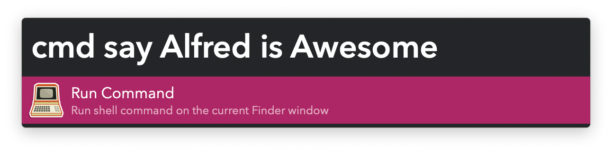
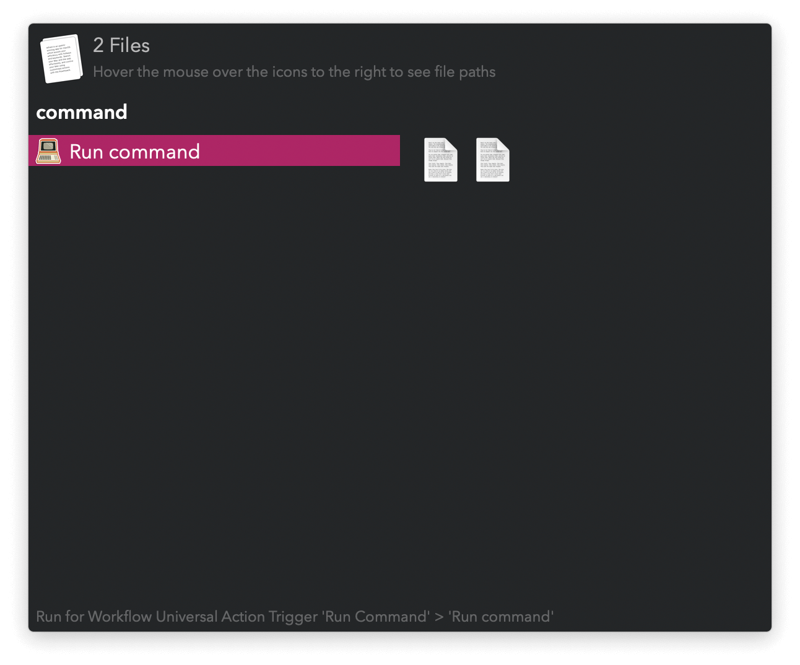
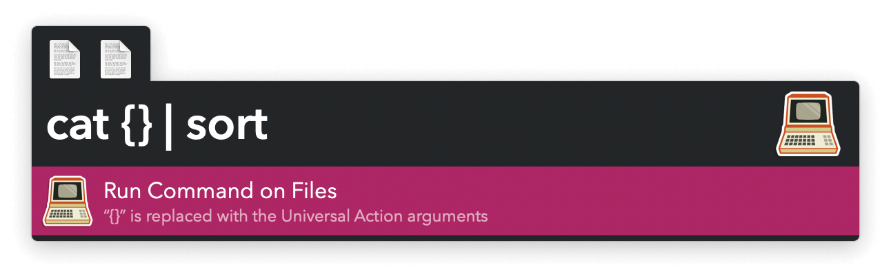
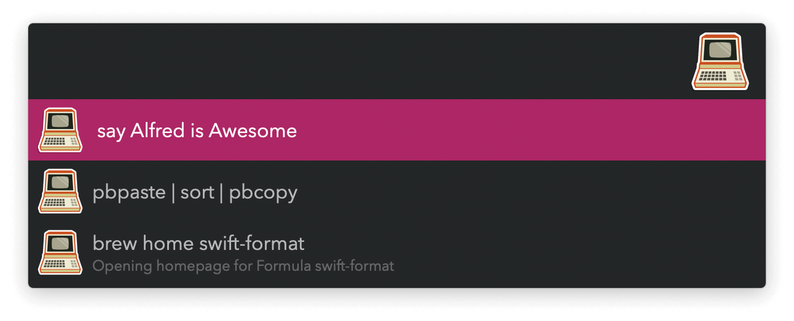

#  Run Command Alfred Workflow

Run commands using your shell configuration

[⤓ Install on the Alfred Gallery](https://alfred.app/workflows/vitor/run-command)

## Usage

Run shell commands without opening a terminal via the `cmd` keyword. Your shell’s configuration files will be loaded, making your custom aliases, functions, and more available to the environment. Commands execute relative to the frontmost Finder window to allow quick changes on the current working folder. Exit status is shown as a notification and output in a [Text View](https://www.alfredapp.com/help/workflows/userinterface/text/).

* <kbd>↩&#xFE0E;</kbd> Run the command.
* <kbd>⌘</kbd><kbd>↩&#xFE0E;</kbd> Run command but do not open output in Text View.
* <kbd>⌥</kbd><kbd>↩&#xFE0E;</kbd> Show command history to rerun a command.

Use the [Universal Action](https://www.alfredapp.com/help/features/universal-actions/) to send files and text as arguments to a command. If the placeholder from the [Workflow’s Configuration](https://www.alfredapp.com/help/workflows/user-configuration/) is present in the text, it will be replaced with your arguments, otherwise they are appended to the end.

The same modifiers apply. Separate command histories are created for commands ran with the Keyword or the Universal Action.

* <kbd>↩&#xFE0E;</kbd> Run command.
* <kbd>⌘</kbd><kbd>↩&#xFE0E;</kbd> Delete all command histories and saved outputs.
* <kbd>⌘</kbd><kbd>Y</kbd> (or tap <kbd>⇧</kbd>) Quick Look saved output.
